#  Trailerflix
[](https://postimg.cc/qNn1tt4n)

### Indice de contenidos 
- [Trailerflix](#trailerflix)
    - [Indice de contenidos](#indice-de-contenidos)
    - [Integrantes](#integrantes)
    - [Repositorio de todos los proyectos](#repositorio-de-todos-los-proyectos)
  - [TrailerFlix](#trailerflix-1)
  - [Tablas](#tablas)
  - [Consultas de Ejemplo](#consultas-de-ejemplo)
    - [Codigo](#codigo)
  
    
### Integrantes 
- Antonella Macri
- Ludmila Kuszñir Ramella
- Camila Martinez Alvarez

### Repositorio de todos los proyectos
```
https://github.com/antomacri/Entrega3
https://github.com/antomacri/FinalIngenias
https://github.com/antomacri/Frutas1
```

## TrailerFlix 
Este proyecto  representa una base de datos llamada "Trailerflix" diseñada para almacenar información sobre películas, géneros, etiquetas, categorías y más. Tambien podes encontrar Peliculas , Series , accion y mucho mas . Algo nuevo que implementamos estos ultimos dias de conocimiento amplio para sumergirnos en un momento de paz y tranquilidad  

## Tablas
- **titulos**: Almacena información detallada sobre las películas y series, incluyendo título, resumen, año de estreno, duración y más.
- **idgenero**: Contiene los géneros de películas, como "Acción", "Comedia" , "Terror", etc.
- **idcategorias**: Categoriza las películas en grupos como "Drama", "Ciencia Ficción", etc.
- **Tags**: Almacena etiquetas o tags que se pueden asignar a las películas.
- **titulos_tags**: Une películas con sus etiquetas.
- **Ranking**: Almacena información sobre la clasificación y comentarios de las series y peliculas.

## Consultas de Ejemplo
Puedes realizar varias consultas en esta base de datos para obtener información específica sobre películas.

1. **Obtener todas las películas de un género específico:**
   ```sql
   SELECT p.titulo
   FROM Peliculas p
   INNER JOIN Pelicula_Genero pg ON p.id = pg.idPelicula
   INNER JOIN Genero g ON pg.idGenero = g.id
   WHERE g.nombre = 'Acción';

# Diagrama de Base de Datos SQL - Trailerflix

Este README proporciona una descripción de la estructura de la base de datos SQL de Trailerflix junto con un diagrama que ilustra las relaciones entre las tablas. 


## Sobre el Diagrama

El diagrama proporciona una vista clara de cómo las tablas están conectadas en la base de datos de Trailerflix:

- La tabla "titulos"  está relacionada con las tablas "idgenero" "titulos_tags", "idcategorias" y "ranking" a través de claves foráneas.

- La tabla "titulos" están relacionada con las tablas  "tags" a través de tablas de unión.

- Esto permite una estructura de datos flexible para gestionar películas y series en conjunto con el genero que desee

### Tablas

URL | PETICION | DESCRIPCION
---:|:---:| ---
|[/frutas](http://localhost:3008/api/v1/fruits) | GET  | Obtener todas las frutas

```mermaid
graph TD;
  
  A[Manzana]-->B[Plátano];
  A-->C[Naranja];
  B-->D[Uva];
  C-->D;
```


### Codigo
```json
 
{
  "name": "Manzana",
  "price": 1.99,
  "quantity": 100
}

```Javacript
 {
        "id": 2,
        "imagen": "🍎",
        "nombre": "Manzanas",
        "importe": 270,
        "stock": 50
    },
    

¡Explora y disfruta trabajando con la base de datos de Trailerflix!

Agradecemos enormemente el apoyo , el profesionalismo , la enseñanza y paciencia de las profesoras . Estamos muy felices de llegar hasta aca con muchas lagrimas y stres pero hemos logrado aprender y a incorporar todos los conocimiento , Ahora es cuestion de practica !! . 

Nuevamente GRACIAS 

Janet y Maria


TRAILERFLIX - INGENIAS BACKEND 2023 
